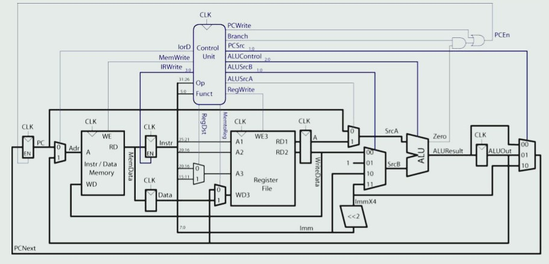

# MIPS_processor

A 32-bit multi-cycle MIPS processor implemented in RTL. The processor architecture is based on the Multi-cycle MIPS design described in Digital Design and Computer Architecture by Sarah Harris and David Money Harris.
Additional R-type instructions and a verification environment were implemented independently. Currently non-pipelined, with plans to add pipelining in the future. Designed for educational and verification purposes using Verilator and Cocotb.

## Block Diagram



## Features

- 32-bit MIPS instruction set (subset)

- R-type: add, sub, and, or, xor, nor, slt

- I-type: addi, andi, ori, lw, sw, beq

- J-type: j

- Multi-cycle datapath

- Testbench support with Cocotb for verification

- Internal instruction and data memory (self-contained)

- Easy to extend with pipelining in the future

- Future-proof for memory-mapped I/O

## Requirements

1. Verilator – for RTL simulation and waveform generation

2. Cocotb – Python-based testbench framework

3. Python 3.x for Cocotb tests

(Optional) Gtkwave

## Directory Structure (unit)
```bash
unit/
├── rtl/             # RTL source files
├── tb/              # Testbench (Cocotb)
├── sim/             # Simulation scripts
├── waveform/        # Waveform
├── README.md
```
## Quick Start

### Install dependencies

1. sudo apt install verilator
2. pip install cocotb

### Usage

1. Load your instructions into inst_mem for simulation.

2. Internal memory values can be checked via testbench.

3. External I/O can be added (in the future) via memory-mapped addresses.

### Future possible Work

- Add pipelining to increase throughput

- Support memory-mapped I/O for connecting to peripherals

- Integrate with OpenLane flow for ASIC implementation
